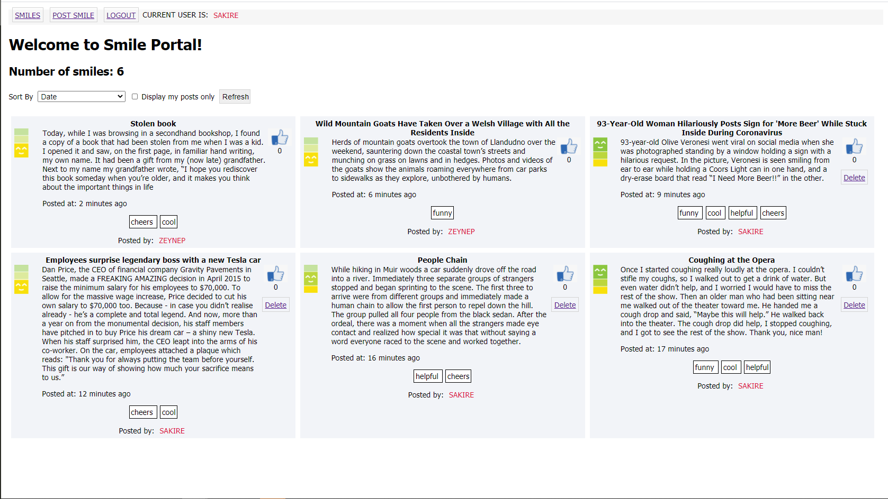
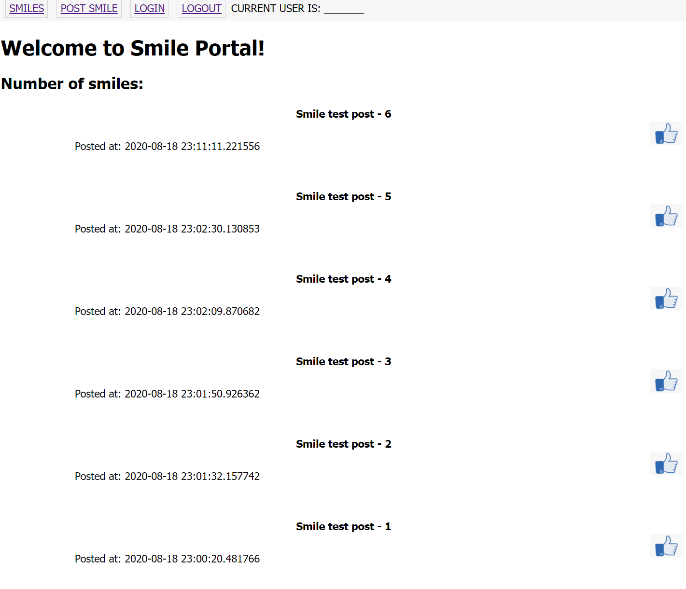
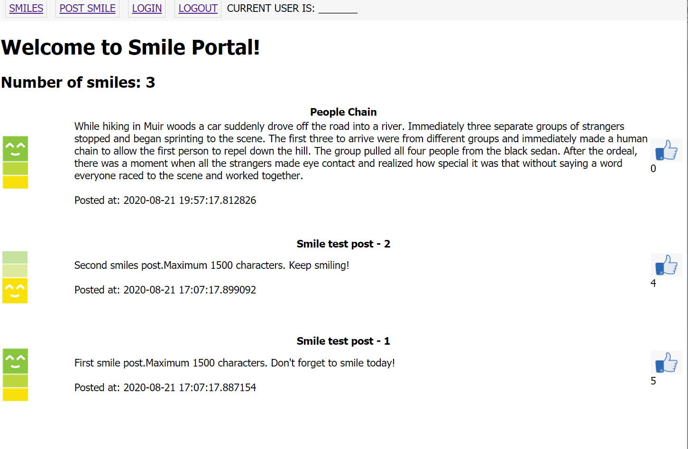
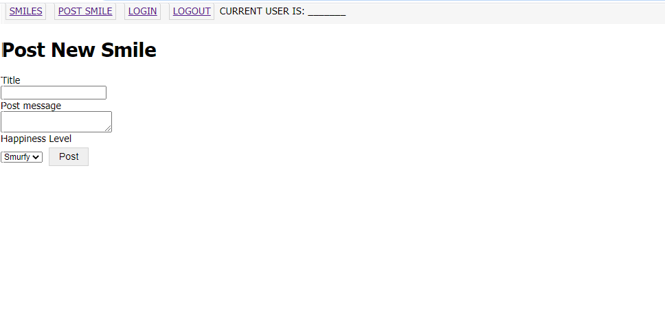
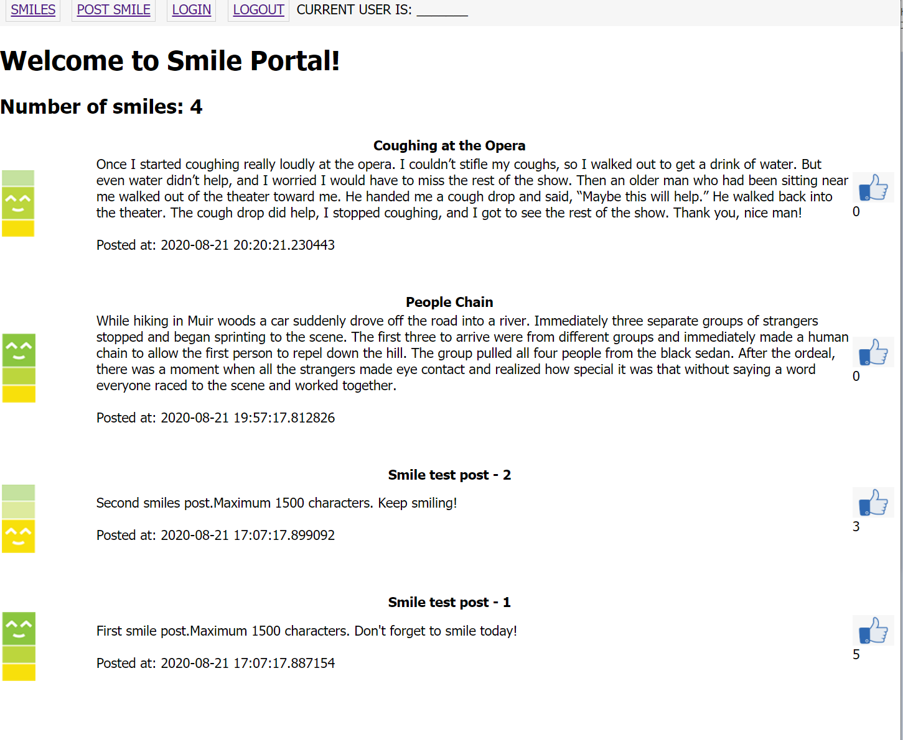
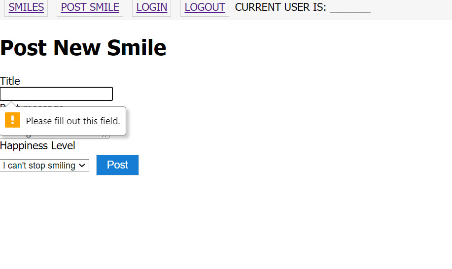
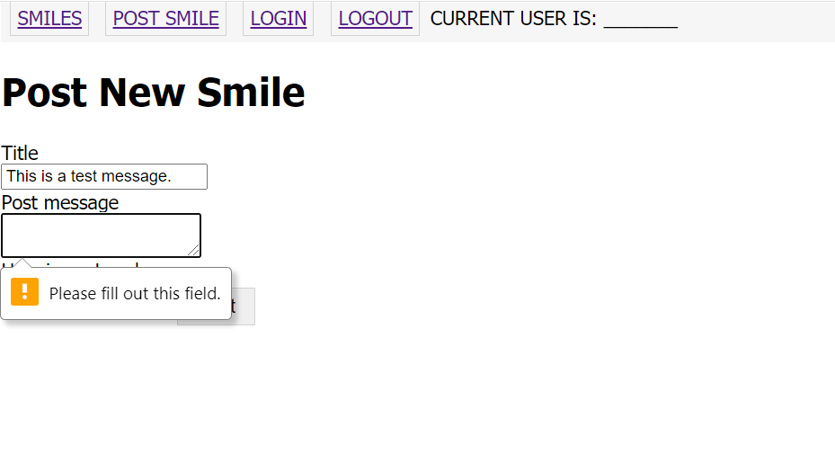
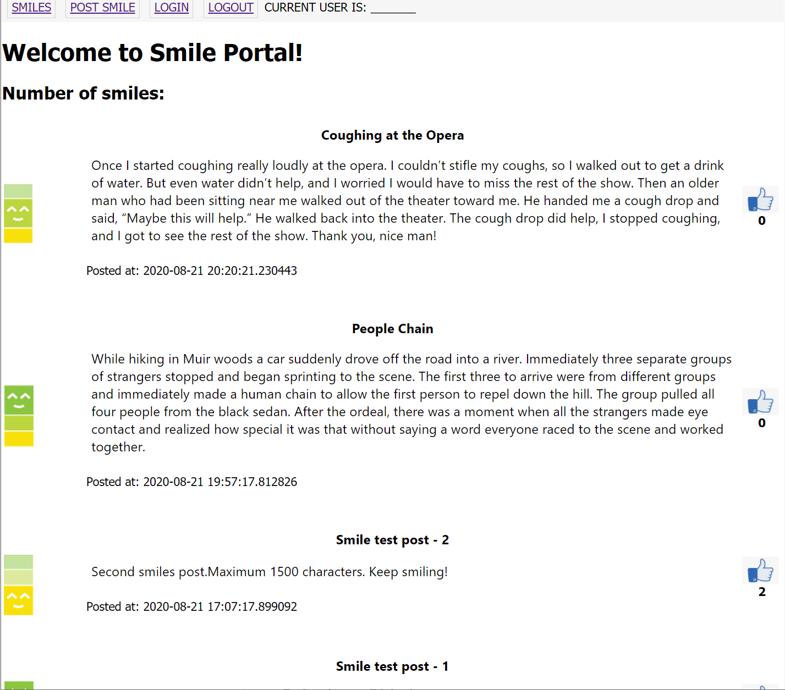
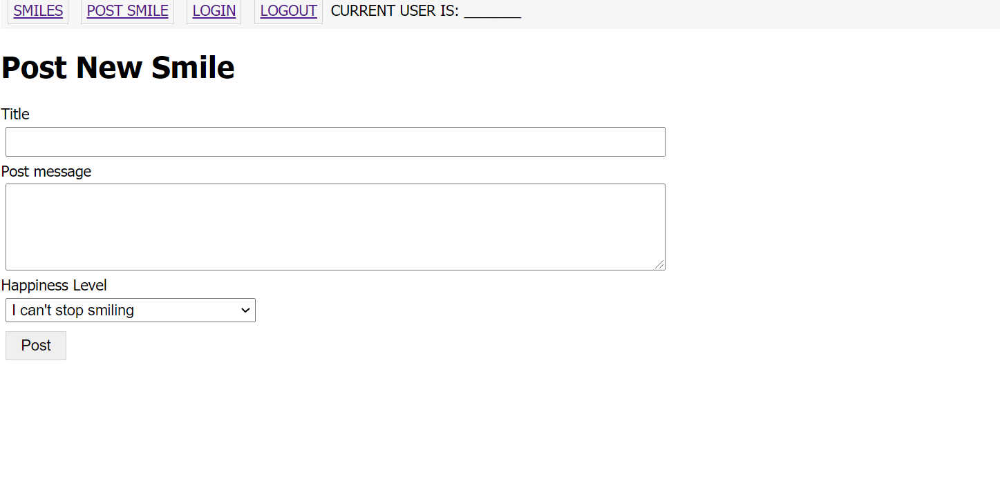

# Warmup Project - CptS322 - Fall 2020

Before we jump into the main team projects, we will practice  web
development by building a simple message portal called "Smile". 

Smile is an app to share experiences from your day that made you smile and things people did that you are grateful for. It's inspired by the Gratitude Journal. Psychologists did a series of research experiments where they had individuals write down three things they are grateful for each day, and it significantly boosted their happiness. But instead of keeping a super secret personal journal, why not spread the happiness? Users can read the "smile" messages others have posted, or post their own. 

The project development is split into three milestones. You'll be building out these features:

1. Milestone-1: Displaying all "smile" posts; creating new posts; liking posts 
2. Milestone-2: Associating tags with posts;  sorting the posts; making the layout responsive.
3. Milestone-3: Adding user signup, login, and logout; displaying user's own "smile" posts; deleting posts.  


This is how it is going to look at the end of milestone-1 of the project:

   <kbd>
    
   </kbd>

---
## Milestone-1: Displaying all "smile" posts; creating new posts; liking posts
---
In part 1, we will focus on the basic features of the app : displaying "smile" posts; creating new posts; liking posts. We will build both the frontend page templates and the backend routes for these features. We will also start building the database of the app.

---
### Task 0: Setup Flask on your `localhost`
---
1. If you haven't yet, go ahead and install [Python](https://www.python.org/downloads/). (Your Python version should be 3.4.x or higher.)

      **Important** (Windows users):
      Please make sure to add the Python path to Windows Path. Read more [here](https://superuser.com/questions/143119/how-to-add-python-to-the-windows-path).
      Also, Windows installer now includes an option to add python.exe to the system search path. When you install Python, [select the "Add Python 3.x to PATH" option](https://www.google.com/url?sa=i&rct=j&q=&esrc=s&source=images&cd=&cad=rja&uact=8&ved=0ahUKEwit9NyWmafWAhXH44MKHaV9CfkQjRwIBw&url=https%3A%2F%2Floadbalancerblog.com%2Fblog%2F2015%2F11%2Fpython-35-install&psig=AFQjCNG10siDMl9gL49FY-3IQHICIPD2pw&ust=1505565091140981). If selected, the install directory will be added to your PATH.

      **Important** (Mac/Linux users): 
      Mac and Linux systems have Python 2.x installed already. When you type and run `python` on the terminal, it will run the Python2 interpreter. To launch Python 3, run `python3` and to run the `python3` installer run `pip3`.

2. Open a terminal or command line window. 
   Run the following commands to install `flask` and `flask-sqlalchemy`. 

    on `Windows`:
    ```
    pip install flask
    pip install flask-sqlalchemy
    ```
    on `Mac/Linux`:
    ```
    pip3 install flask
    pip3 install flask-sqlalchemy
    ```
  
    Note for Windows users: If `pip` is not installed in your system, you need to also add the Python\Scripts path to the Windows Path. On Windows, Python will typically be installed under the directory `C:\Users\<username>\AppData\Local\Programs\Python\Python3.x`. Locate your Python installation directory, make sure `pip` or `pip3` is under the `Scripts` directory, and add the "path of Scripts directory" to the Path environment variable. 

---
### Task 1: Get Started with the Provided Files
---
To help you start we have provided some boilerplate files that you will have to modify to implement the project.


1. Clone the repository [smile_322_skeleton repository](https://gitlab.eecs.wsu.edu/322-fall20-examplecode/smile_322_skeleton) on the working machine
    ```
    git clone https://gitlab.eecs.wsu.edu/322-fall20-examplecode/smile_322_skeleton.git
    ```
    **You'll be prompted to enter your username and password** (those you used to login gitlab.eecs.wsu.edu). If succeeded, you'll see a new directory show up.
  
2.  The repo you cloned includes two branches: (i) master which includes the readme files and (ii) milestone1 which includes the given skeleton code.  Go to the repo directory and make sure that bot branches are cloned.  `git branch` should list the branches master and milestone1. 
    ```
    cd smile_322_skeleton/
    git branch
    ```
   Checkout to `milestone1` branch that has already been created for you.
    ```
    git checkout milestone1
    ```

3. You now have a local copy of the `smile_322_skeleton` repository.

    ```
    git remote -v
    ```
    This will display all remote repositories. Currently, it should show the following:
    ```
    git remote -v
    origin  https://gitlab.eecs.wsu.edu/322-fall20-examplecode/smile_322_skeleton.git (fetch)
    origin  https://gitlab.eecs.wsu.edu/322-fall20-examplecode/smile_322_skeleton.git (push)

    ```
    We will create a **private** repository for each of you on EECS GitLab server and you will commit everything to this repository. The name of this repository is `<yourlastname>-warmup`. (Make sure that this repository shows up in your GitLab account.) 

    Now, we will remove the current origin of the  `smile_322_skeleton` repository and add the `<yourlastname>-warmup` as the new origin. 

    Remove the commit origin with the following command.

    ```
    git remote remove origin
    ```

4. Next you need to add your repository as the new origin.

    ```
    git remote add origin https://gitlab.eecs.wsu.edu/322-fall20-arslanay-warmup/<yourlastname>-warmup
    ```
    IMPORTANT NOTE: Replace "`<yourlastname>`" with your own lastname. **REMOVE enclosing angle brackets , i.e., <>**.  

    You can `git remote -v`  to make sure origin is changed.


5. Push the code to your new branch.
    ```
    git push --set-upstream origin master
    git push --all
    ```
    Now if you go to your EECS GitLab repo, you will see all of the relevant files. Make sure that both `master` and `milestone1` branches are pushed to the GitLab sever. 

    To keep your local repo name consistent, rename your local repo directory. 
    ```
    cd ..
    mv smile_322_skeleton/ <yourlastname>-warmup
    cd <yourlastname>-warmup
    ```

6. Switch to branch named `milestone1`
    ```
    git checkout milestone1
    ```
    You will now be editing locally, and **remember to commit frequently**.

    You will find the following provided files:

```bash
  * app
        * static
        * css
            * main.css
        * happiness-level-1.png  image for happiness-level-1
        * happiness-level-2.png  image for happiness-level-1
        * happiness-level-3.png  image for happiness-level-1
        * like.png               icon for like button
        * templates
            * 404error.html      HTML template page for displaying 404 errors
            * 500error.html      HTML template page for displaying 404 errors
            * _post.html         HTML sub-template for displaying a smile post
            * base.html          base “skeleton” template that contains all the common elements of HTML pages.  
            * create.html        HTML template for "smile" post page
            * index.html         HTML template for the main page 
            * login.html         HTML template for the login page 
            * register.html      HTML template for the user sign-up page 
        * __init__.py            Python script that initializes the app. 
        * errors.py              Error handlers for 404 and 505 errors
        * forms.py               Flask-WTF forms 
        * models.py              Database models
        * routes.py              Flask routes
  * .flaskenv                    
  * config.py                    Python script that defines app's configuration variables 
  * smile.py                     Main application module
  * favicon.ico
```
           
In milestone-1, you will have to make changes to the following files:

 * `main.css` 
 * `_post.html`
 * `base.html`
 * `index.html`
 * `create.html`
 * `forms.py`              
 * `models.py`              
 * `routes.py`

7. How to run the app:

    * First run the backend (this will run the app in debug mode):
  
       `set FLASK_DEBUG=1 && python -m flask run`

    * Open a browser (Chrome is recommended) and open the URL 'http://localhost:5000/'
    At this point, the page should look like the following. 
   
   <kbd>
    
   </kbd>
 
 **The provided code already implements the following:**

* initializes the app; configures the app for SQL-Alchemy database connection (see `__init__.py`)
* defines a preliminary DB model that includes a table for certain fields of the post messages. (see '`models.py`)
* creates the (SQlite) database file (see `initDB` function in `routes.py`)
* creates a preliminary Flask-WTF form for reading the post data.   


---
### Task 2: Display "Smile" Posts
---
The first page you'll build is the home page. This page will show all smiles posted by everyone.

1. First, we need to update the database model for "posts" and add the missing fields. 

    In milestone-1, the schema for the "Post" model should include the following attributes. In milestones-2 and -3, we will add couple other fields to the Post schema as we add more features to our app (this is a suggestion, although other schemas may work just as well):

    **Add the missing fields to the "Post" model.** 

    |    |  Field name    | Description |  Field type  |  Constraints | Comments  
    |:---|:----:          |:----:       | :-----:      |  :-----:     | :-----:
    | 1. |  id            | auto generated id | integer | primary key  | (already included)
    | 2. |  title         | post title        |  string | max 150 chars   | (already included)
    | 3. |  body          | smile message     |  string | max 1500 chars   | 
    | 4. |  timestamp     | time the smile post was created| DateTime | default value is set to the UTC time when the post is created | (already included) 
    | 5. |  likes         | number of likes for the smile port | integer| default is set to 0 |
    | 6. |  happiness_level | the happiness level associated with the smile post | integer| default is set to 3 | (already included)


   **Important note:**  In order to re-create the database with the new schema, you need to first delete the current database file `smile.db` and re-run the backend app. The decorator function `initDB` in `routes.py` will re-create the database file before the first request to the app. 
   Alternatively, you may migrate the database to the modified structure using `flask-migrate`. Check the Flask tutorial "Databases" post for more information. <a href = "https://blog.miguelgrinberg.com/post/the-flask-mega-tutorial-part-iv-database">https://blog.miguelgrinberg.com/post/the-flask-mega-tutorial-part-iv-database</a>

   After the database is re-created, no smile posts will be displayed on the main page. You need to manually insert couple posts on the Python prompt. 

   For example:

   ```
   > python3
   >>> from app import db
   >>> from app.models import Post
   >>> p = Post(title="Smile test post - 1", body = "First smile post.Maximum 1500 characters. Don't forget to smile today!", likes=5, happiness_level = 3)
   >>> db.session.add(p)
   >>> p = Post(title="Smile test post - 2", body = "Second smiles post.Maximum 1500 characters. Keep smiling!", likes=2, happiness_level = 1)
   >>> db.session.add(p)
   >>> db.session.commit()
   ```

   You can add several other smiles posts by repeating the last 3 commands above. 

2. In `_post.html` add the remaining parts of a smile post to the HTML template. Look for the comments to find out where each item should be added to. 

    1. Add the "happiness level" image : There are 3 different happiness level images included under `smile_322_skeleton\code\app\static` and you should include the correct image according to the "happiness_level" value of the post, i.e., happiness-level1 ->  `happiness-level-1.png`;  happiness-level2 ->  `happiness-level-2.png`, etc.<br> You should use a nested "if-else" block to include the correct image.  
        For an example on how to add an image in Jinja2 HTML template, see the `like.png` image on line #18. The `width` of the happiness image should be `40px`. 

        Note that, you don't need the include the `href` attribute for happiness level image.  

    2. Add the post body.
    
    3. Add the like count of the post. 

  When you open the main page on the browser (i.e., `http://localhost:5000/`), the page may look like the following. 

  <kbd>
    
  </kbd>

---
### Task 3: Create "Smile" Post
---

1. In `forms.py`, edit the `PostForm` and add an input field (`TextAreaField`) for the smile message "body". Add a data validator that will enforce that the smile post message is not empty (i.e., at least one character long), and it is at most 1500 characters long.  
Other form input fields for the title and happiness level inputs are already provided. Note that the form doesn't need to include a  "likes" vfiled. A new Smile post will have "0" likes by default. 

    **Note**: Make sure to import `TextAreaField` from `wtforms`.  

2. In `create.html`, edit the HTML template for smile post page and add the form items for smile message "body" and "happiness level". When the field validators for post "body" and "title" fail, an error message should be displayed. Make sure to display field validation error messages for title and body if the user enters invalid input. 

3. In `routes.py` add a new view function that renders the smile post form.  

    * URL : `/postsmile`
    * Methods: 'GET' and 'POST'

    The view function should implement the following:

    - It should create an instance of `postForm` and pass it to the `create.html` template for rendering. 
    - When the form is submitted, it should create a new `Post` item based on the form input and insert it to the database. 
    - It should issue a `flash()` message, that informs  the new smile post is created. You may include the post title or body in the message as well. 
    - Then, it should redirect to the `index` page. (check the class exercises for examples on how to redirect to a new page. )  

    **Note** :Please use the conditional  `if form.validate_on_submit()` to make sure that user input is valid when the form is submitted. 

4. In `base.html`, add a link to the "Post Smile" page in the navigation bar. Remember that `/postsmile` route renders the 'create.html' page which displays the form for creating a smile post. There is already a placeholder "Post Smile" in `base.html`. You just need to add the URL for the `href` property.

5. On the main page, when you click at the "Post Smile" link in the navigation bar, the app should redirect to `http://localhost:5000/postsmile`. 

<kbd>
    
</kbd>

6. Fill out the form and create a smile messages. The app should redirect back to the main page and display the new smile post. 

<kbd>
    
</kbd>

7. When the post form is submitted, if no text is provided for title or body of the smile post, an error message should be displayed. 

    <kbd></kbd>

    Similarly, if the smile message post message exceeds 1500 characters, an error message should be displayed.  
    <kbd></kbd>


---
### Task 4: Stylin' It Pretty
---
It's coming along! Now let's style it nicer and make it look like an actual app. We only have the following styling guidelines as far as what we're
grading you on. You can any additional styling to make it look however you
think looks awesome.
For this task you will edit `/app/static/css/main.css` in addition to the HTML template pages.

1. Styling the `base.html` that displays the navigation bar and the flash message:

    In the given skeleton code, `main.css` already defines the CSS style definitions for `\nav-container` which is applied to the navigation bar. 

    To style the `flash` messages, define a CSS class selector called  `flash-container` class (in `main.css`) and use it to style the `</div>` element that encloses the flash message. You should specify appropriate background color, height, font style and size, padding, and margin for the flash messages. 

    **Important note:** Some browsers don't refresh the page correctly after changes are made to CSS styling. You need to clear the cash and refresh (press Ctrl+Shift+R) to see the changes. 

2. Styling the `_post.html` that displays the smile messages:

    1. The `posttitle` selector in `main.css` styles the title in a post message. Edit `posttitle` and specify appropriate font styling and padding.
    2. Add a class selector called `postmessage` to style smile message body. Specify appropriate font styling, margins, and padding for the post body.  
    3. Add a class selector called `likecount` to style happiness-level image and like count. The alignment should be centered and font should be bold.    

    When you open the main page on the browser (i.e., `http://localhost:5000/`), the page may look like the following. You are welcome to style your page different than what is shown in the below image. As long as it is neat and organized, we will accept it.  

    <kbd></kbd>

2. Styling the `create.html` that displays the smile post form:

    1. Add a class selector called `formtitle` to style title input box. Specify appropriate size (width), font styling, margins, and padding. Make sure to specify the size values as percentages.  
    **Note:** The class argument is passed to form fields as input. See the  example for submit button in `create.html`. 
    3. Add a class selector called `formbody` to style post body input box. Specify appropriate size (width, height), font styling, margins, and padding. Make sure to specify the size values as percentages.  
    3. Add a class selector called `formselect` to style happiness level selection box. Specify appropriate size (width, height), font styling, margins, and padding. Make sure to specify the size values as percentages. 

    When you open the smile post page on the browser the page may look like the following. 

    <kbd></kbd>

---
### Task 5: Liking a Smile Post
---
1. When the like button for a smile post is clicked, the like count for that smile should be incremented by 1. To accomplish this we will implement a view function in `routes.py` with URL `/like/<post_id>`  

    * URL : `/like/<post_id>`
    * Methods: 'GET' 

    The view function of the route should implement the following:

    * Retrieve the post with id `post_id` from the database
    * Increment the post's like count by 1.
    * Write the updated post back to the database
    * Since the current page is the main page (i.e., `/index`), you don't need to redirect to a different page. 
    * Retrieve all the posts from the database and render `index.html` with the update form. 

2. Now, in `_post.html`, assign the `href` attribute of like link ( i.e., `like.png`) to the like route URL `like`. See the class exercise for examples on how to pass the route variable to `url_for'. 

Open the main page `http://localhost:5000/`, click at a like button, and make sure that the like count is incremented. 

---
### Task 6: Displaying the Number of Smiles
---
Lastly, we will update the main page and display the total number of smile posts at the top of the page. 

In `index.html`, edit the  `<h2>` subtitle at the top of the page and include the number of post messages.

When you complete milestone-1, the index page may look like this. 

<kbd></kbd>

---
### How to Submit
---
#### Submit on GitLab

1.  Commit your changes locally. Make sure you are in branch `milestone1`. 
    ```
    git checkout milestone1
    git add .
    git commit -m "Your own commit message"
    ```

1. Push the `milestone1` branch to GitLab:
    ```
    git push origin milestone1
    ```
    - You can commit multiple times. Please make sure not to make any commits to `milestone1` branch after the milestone1 deadline. 
   

 


